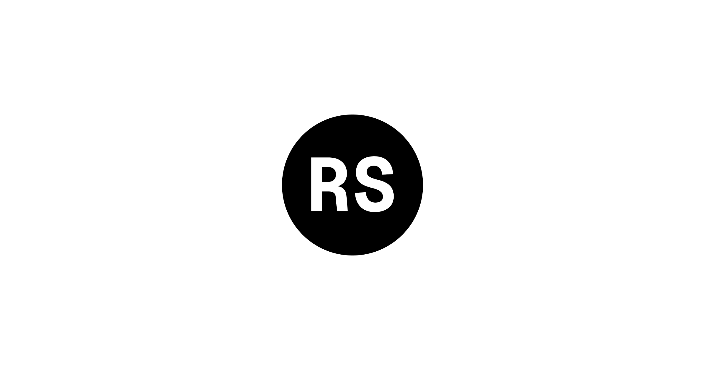
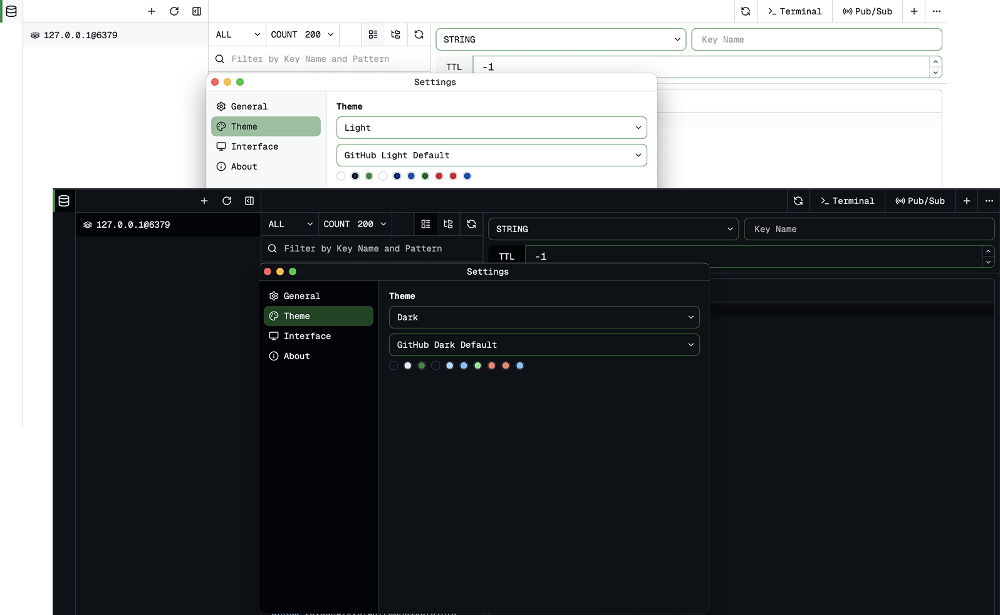

<div align="center">
  
</div>

<div align='center'>
  <a href="https://www.npmjs.com/package/@xuerzong/redis-dash">
    
  </a>

  <a href="https://www.npmjs.com/package/@xuerzong/redis-dash">
    
  </a>
  
  <a href="https://github.com/xuerzong/redis-dash/blob/main/LICENSE">
    
  </a>
</div>

<p align="center">English | <a href="./README.zh-CN.md">简体中文</a></p>

🚀 **Redis Dash** is a lightweight(<2MB), cross-platform Redis GUI (Graphical User Interface) Client. Redis Dash is designed to provide a simple and efficient way to manage and monitor your Redis instances.

<p align='center'>
  
</p>

## ✨ Features

- 🔗 **Multi-Connection Support:** Easily manage and switch between multiple Redis instances.
- 🔎 **Intuitive Key Browser:** Browse, search, edit, and delete various data types (String, List, Hash, Set, ZSet).
- 💻 **Built-in CLI Console:** A powerful Redis Command Line Interface (CLI) allows you to execute native Redis commands directly.
- 🌍 **Cross-Platform:** Supports Windows, macOS, and Linux.

## 🚀 Get Started

### Install

> [!IMPORTANT]
> Before installation, you need to install [Node.js 18+](https://https://nodejs.org/).

You can install the Redis Dash command-line tool globally via npm (Node Package Manager).

```bash
npm -g @xuerzong/redis-dash
```

### Start Server

> [!NOTE]
> Redis Dash runs as a standalone application, and its server provides the web interface. You still require a running Redis instance to connect to and manage your data.

After installation, use the `rds` command to manage the background service for Redis Dash.

- Check Version

```bash
rds --version # OR `rds -V`
```

- Start Service

```bash
rds start
```

- Stop Service

```bash
rds stop
```

- Restart Service

```bash
rds restart
```

## 🔨 Configuration

### Default Settgins

By default, the Redis Dash service runs on port `5090` on localhost.

### Custom Port

You can specify a different port using a command-line flag when starting the service:

```bash
rds start --port 9000
```

## 💻 How To Dev

```bash
cd ./redis-dash

npm install

npm run start
```
