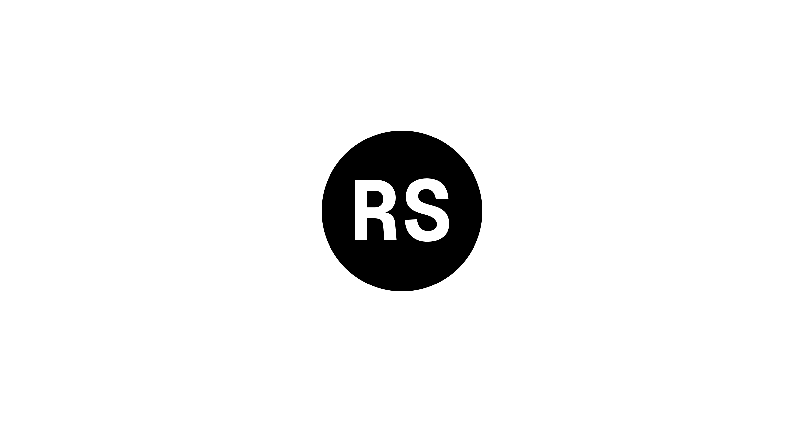
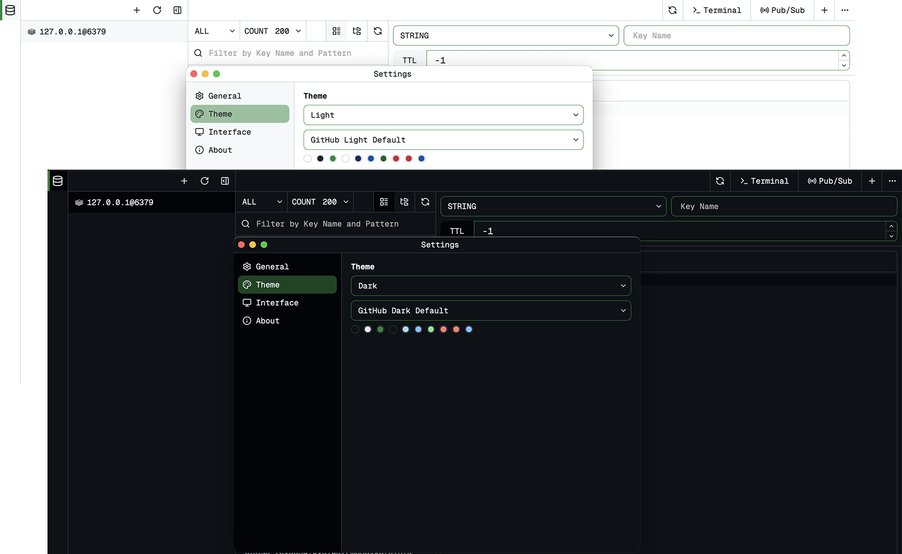

<div align="center">
  
</div>

<div align='center'>
  <a href="https://github.com/xuerzong/redis-dash/blob/main/LICENSE">
    
  </a>
</div>

🚀 **Redis Dash** 是一个跨平台的 Redis GUI（图形用户界面）客户端。Redis Dash 旨在提供一种简单高效的方式来管理和监控您的 Redis 实例。

<p align='center'>
  
</p>

## ✨ 特性

- 🔗 **多连接支持:** 轻松管理和切换多个 Redis 实例。
- 🔎 **直观的 Key 浏览器:** 浏览、搜索、编辑和删除各种数据类型（String、List、Hash、Set、ZSet）。
- 🎨 **Shiki 主题选择:** 支持从 Shiki 主题列表中选择界面主题。参见 https://shiki.style/themes。
- 💻 **命令行控制台:** 内置一个强大的 Redis 命令行界面 (CLI)，允许您直接执行原生 Redis 命令。
- 🌍 **跨平台:** 支持 Windows、macOS 和 Linux。

## 🚀 开始使用

### 安装

> [!IMPORTANT]
> 已不再支持通过 npm 安装，请使用最新安装脚本。

使用独立安装脚本安装 Redis Dash：

```bash
curl -fsSL https://download.xuco.me/redis-dash/install.sh | sh
```

安装指定版本：

```bash
curl -fsSL https://download.xuco.me/redis-dash/install.sh | RDS_VERSION=0.2.0 sh
```

安装脚本会下载当前平台的 bundle，将其安装到 `/usr/local/lib/redis-dash` 或 `~/.local/share/redis-dash`，并把 `rds` 链接到 `/usr/local/bin` 或 `~/.local/bin`。

安装脚本默认使用 `https://download.xuco.me/redis-dash` 作为分发源。

### 启动服务

> [!NOTE]
> Redis Dash 作为独立应用程序运行，其服务器提供 Web 界面。您仍然需要一个正在运行的 Redis 实例才能连接并管理您的数据。

安装后，使用 `rds` 命令来管理 Redis Dash 的后台服务。

- 检查版本

<!-- end list -->

```bash
rds --version # 或者 `rds -V`
```

- 启动服务

<!-- end list -->

```bash
rds start
```

- 停止服务

<!-- end list -->

```bash
rds stop
```

- 重启服务

<!-- end list -->

```bash
rds restart
```

## 🔨 配置

### 默认设置

默认情况下，Redis Dash 服务在本地主机（localhost）的 `5090` 端口上运行。

### 自定义端口

您可以在启动服务时使用命令行标志来指定不同的端口：

```bash
rds start --port 9000
```

## 💻 如何开发

```bash
cd ./redis-dash

npm install

npm run start
```

## 📦 发布

构建前端资源、编译 Rust 服务端二进制，并生成独立二进制分发产物：

```bash
npm run release
```

命令执行完成后：

- 平台原生二进制位于 `dist/native/<platform>/rds`
- 独立二进制分发目录位于 `dist/binary/<platform>`
- 独立安装归档位于 `dist/binary/rds-<platform>.tar.gz`

GitHub Actions 发布流程：

- 推送 `v*` tag 后，自动构建二进制并创建或更新 draft GitHub Release。
- 手动检查 draft release。
- 确认该版本可以正式发布后，再手动运行 `Publish Updater Manifest` workflow，为该 release 附加 `latest.json`。
- 最后运行 `Upload Release to R2` workflow，把 release 资产和 `latest.json` 同步到 `https://download.xuco.me/redis-dash`。
